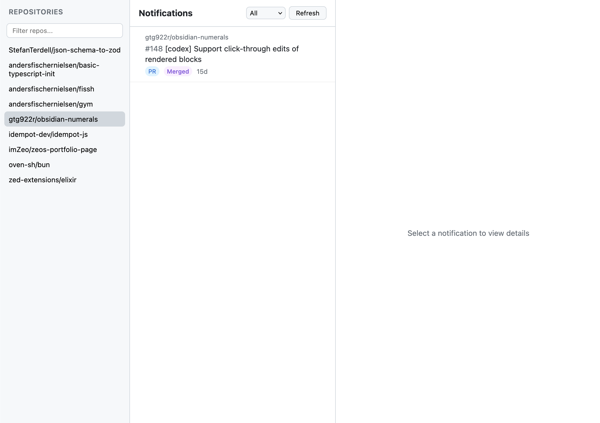
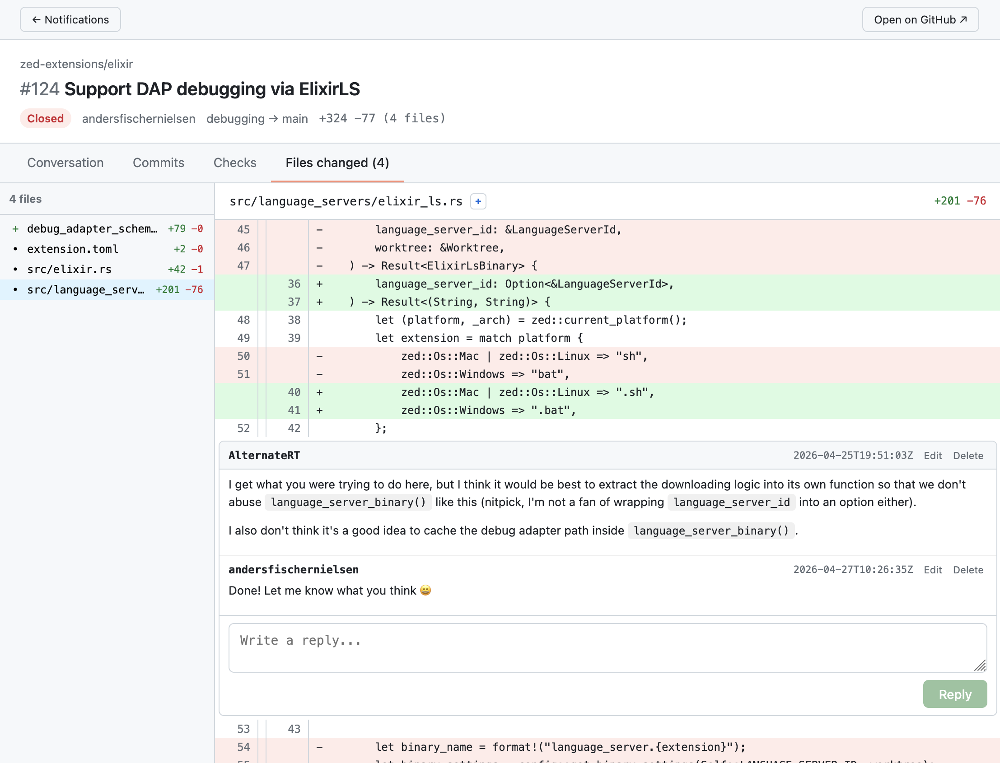

# github-frontend

A faster UI for GitHub notifications, PRs and Issues.

---

Written using Svelte with all data being fetched from the GitHub API, focusing on performant fetching and rendering.

Requires a Classic GitHub token (only ever persisted in the browser). No data is being stored on the server.
